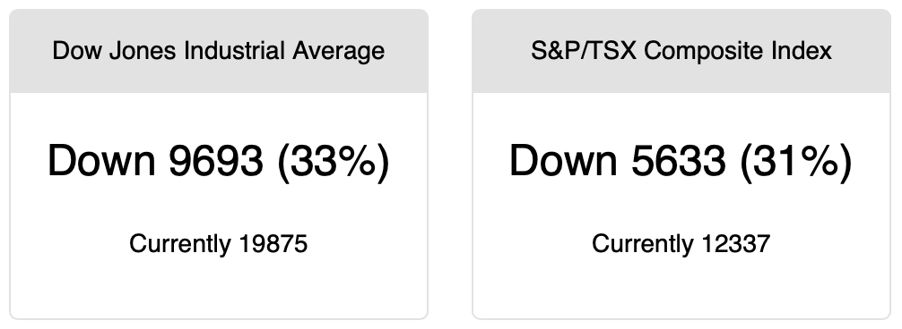

# CovidStocks

Displays popular real-time stock index values to calculate how much the markets have fallen since the global COVID-19 health emergency, utilizing Python, Flask, and BeautifulSoup.

## Concept
In the wake of the global response to and market uncertainty regarding COVID-19, stock markets fell dramatically. A web app can use current stock values to display a simple reading of how far below the pre-COVID peak the markets are currently sitting.

Stock value feeds can be expensive and difficult to access, but can be scraped in real-time from public websites.

## Example

